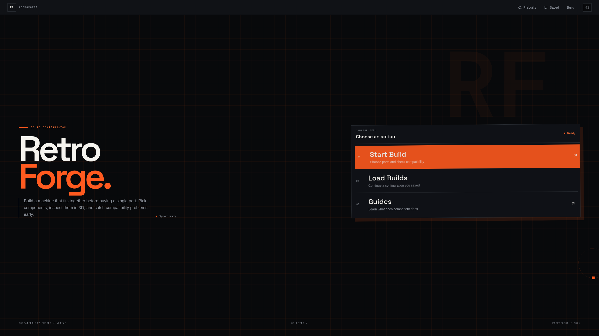
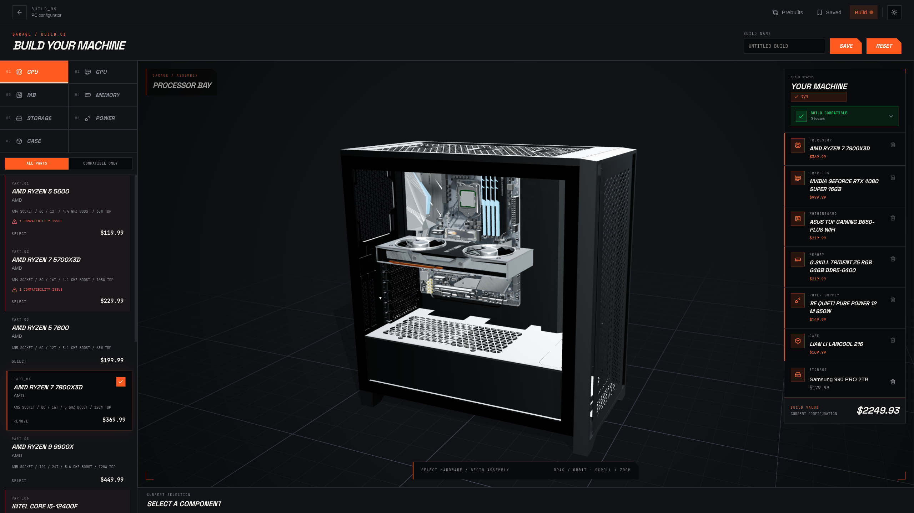
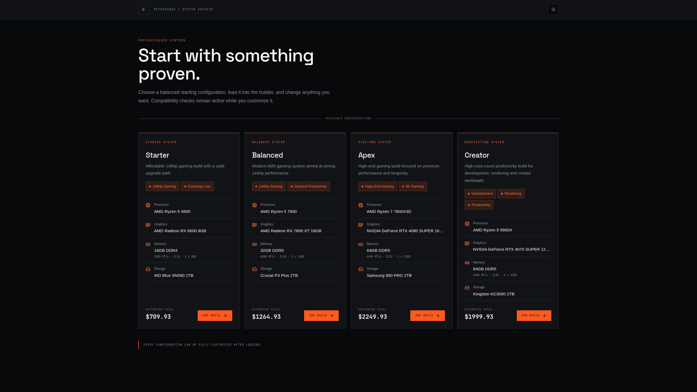

# RetroForge

**Plan, check, and visualize a custom PC before buying the parts.**

RetroForge is an interactive 3D PC builder. Choose components from the catalogue,
check whether they work together, preview the assembled system, and save builds in
your browser.

[Open the live app](https://retroforge-iota.vercel.app/) · [Run locally](#run-locally) · [View the roadmap](#roadmap)



## What you can do

- Build a PC with a CPU, GPU, motherboard, RAM, storage, PSU, and case.
- Explore the build in an interactive 3D viewport with orbit and zoom controls.
- Filter parts by compatibility and review warnings before installing a conflict.
- Start from a preconfigured gaming or workstation build.
- Save named builds to the browser and load them later.
- Use the builder on desktop or mobile in light or dark mode.

## Product preview

### 3D builder



### Preconfigured systems



## Compatibility coverage

RetroForge evaluates a candidate part before installation and rechecks the build
after each change.

| Check | Current status |
| --- | --- |
| CPU socket ↔ motherboard | Working with a detailed warning |
| RAM generation ↔ motherboard | Working with a detailed warning |
| GPU length ↔ case clearance | Working with a detailed warning |
| Storage connector, slots, and protocol ↔ motherboard | Enforced during selection; detailed rule errors are WIP |
| PSU wattage ↔ GPU | Basic headroom rule exists; full-system power calculation is WIP |
| Case ↔ motherboard form factor | Basic rule exists; detailed user feedback is WIP |

Users may deliberately continue past supported warnings. Compatibility results
are guidance only and should be verified against the manufacturers' specifications
before purchasing hardware.

## Run locally

### Requirements

- Node.js 22.12 or newer
- npm or pnpm

```bash
git clone https://github.com/Nihar-potdar/retroforge.git
cd retroforge
npm install
npm run dev
```

Vite will print the local address. Open it and select **Start Build**.

### Commands

```bash
npm run dev       # start the development server
npm run build     # type-check and create a production build
npm run lint      # run ESLint
npm test -- --run # run the Vitest suite once
npm run preview   # preview the production build
```

## Current limitations

RetroForge is under active development. The main builder works, but these areas
are not finished yet:

- The catalogue and prices are static, limited sample data—not live market data.
- Some compatibility rules exist internally but do not yet produce clear,
  actionable warnings in the interface.
- Power compatibility only uses GPU draw and a fixed PSU headroom value; it does
  not estimate the complete system load.
- Not every catalogue part has a unique 3D model or exact physical placement.
- Saved builds live in `localStorage`, so they do not sync across browsers or
  devices and may be lost when browser data is cleared.
- Automated tests are being set up; the current test command does not discover a
  valid suite. 
- The production build succeeds, but the 3D builder chunk is still large and
  triggers Vite's chunk-size warning.

## Tech stack

- **Frontend:** React 19, TypeScript, Vite, Tailwind CSS
- **3D:** Three.js, React Three Fiber, Drei
- **State and validation:** Zustand, Zod
- **Routing and motion:** React Router, Motion, GSAP
- **Testing and deployment:** Vitest, Vercel

The main code lives in:

```text
src/
├── Logic/Compatibility/  # compatibility engine and rules
├── Pages/                # home, builder, prebuilts, and guides
├── components/           # 3D viewport and shared UI
├── data/                 # component catalogue and prebuilts
├── models/               # 3D model components
├── stores/               # Zustand state
└── zod/                  # saved-build validation
```

## Roadmap

- [ ] Give every compatibility rule a detailed, actionable error.
- [ ] Add cooler, fan, radiator, RAM-slot, M.2, SATA, and PCIe clearance checks.
- [ ] Estimate total system power instead of GPU-only PSU headroom.
- [ ] Expand the catalogue, 3D model coverage, and regularly updated pricing.
- [ ] Add budget, performance, brand, and use-case filters.
- [ ] Add accounts, cloud saves, shareable links, and build comparisons.
- [ ] Build a real automated test suite and resolve the remaining lint issue.
- [ ] Reduce the builder bundle size and improve accessibility.

The long-term goal is a builder that helps beginners understand each component
without hiding the technical detail experienced users need.

---

Built by [Nihar Potdar](https://github.com/Nihar-potdar).
